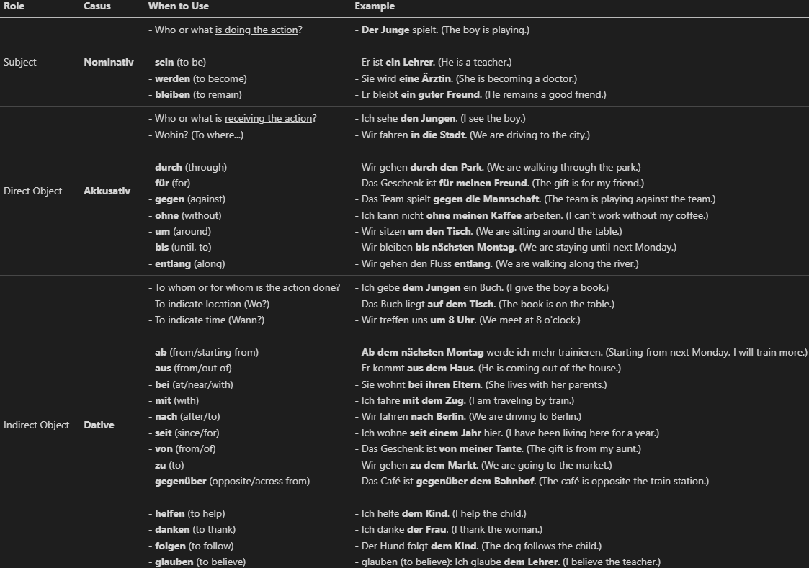
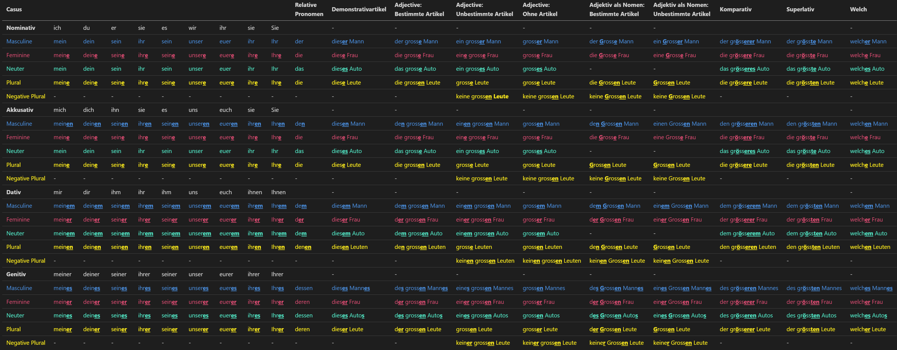
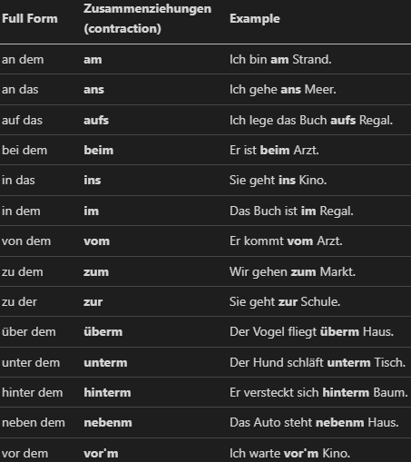
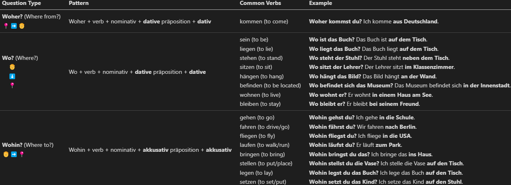
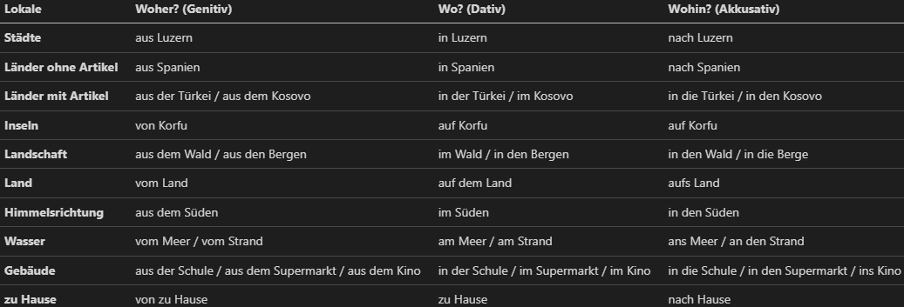
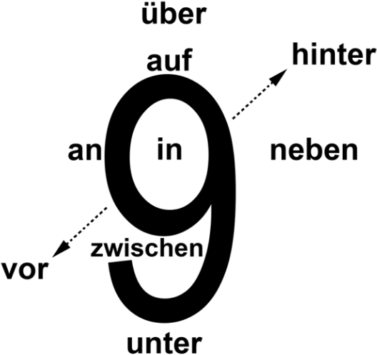

# german-cheatsheets
A collection of cheat sheets to learn German.

# Cases

# Declinations

# Contractions

# Woher, Wo, Wohin

# Lokale Präpositionen

# Wechselpräpositionen

Source: https://www.nthuleen.com/saddleback/review/Reading_Guide_15-1-Two_Way_Prepositions.pdf

# Temporale Präpositionen (seite 38)

# Temporale Adverbien (seite 46)

# Konjunctionen (seite 50, 62, 70, 78, 126)

# Reflexiv Verben (seite 66)

# Passiv präsens (seite 82)

# Verben mit Dativ und Akkusativ (86)

# Indirekte fragen (94)

# Verben mit präpositionen (seite 102)

# Fragen und Präpositionaladverbien (seite 102)

# Modalverben

# Modalverben: Präteritum (114)

# Relativpronomen un Relativsatz (seite 130)

# Präteritum (seite 133)

#

