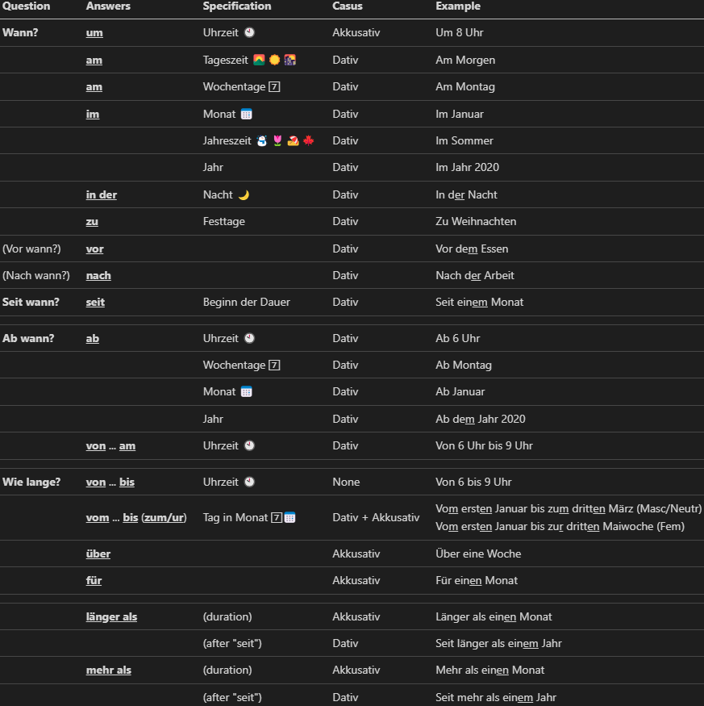

# german-cheatsheets
A collection of cheat sheets to learn German.

## Cases

## Declinations

## Contractions

## Woher, Wo, Wohin

## Lokale Präpositionen

## Wechselpräpositionen

Source: https://www.nthuleen.com/saddleback/review/Reading_Guide_15-1-Two_Way_Prepositions.pdf

## Temporale Präpositionen (seite 38)

## Temporale Adverbien (seite 46)

## Konjunctionen (seite 50, 62, 70, 78, 126)

## Reflexiv Verben (seite 66)

## Passiv präsens (seite 82)

## Verben mit Dativ und Akkusativ (86)

## Indirekte fragen (94)

## Verben mit präpositionen (seite 102)

## Fragen und Präpositionaladverbien (seite 102)

## Modalverben

## Modalverben: Präteritum (114)

## Relativpronomen un Relativsatz (seite 130)

## Präteritum (seite 133)

##

# Contributing
Create an .md file for every section.

For every .md file:
- Set dark theme in Visual Studio Code.
- Take a screenshot of the .md file and add it to the README.md file.
- Save it with the same name as the section.
- Include it in the README.md file.
- Set light theme in Visual Studio Code.
- Take a screenshot of the .md file and add it to the README.md file.
- Save it with the same name as the section.

The white background is for printing.

To enhance printing:

Tools:
 - [Markdown All in One](https://marketplace.visualstudio.com/items?itemName=yzhang.markdown-all-in-one)
 - [Live Preview Server](https://marketplace.visualstudio.com/items?itemName=negokaz.live-server-preview)
   - This seems to have some wierd interaction with https://marketplace.visualstudio.com/items?itemName=bierner.markdown-mermaid
 - [Open in Application](https://marketplace.visualstudio.com/items?itemName=FabioSpampinato.vscode-open-in-application)
 - [Pretty Formatter](https://marketplace.visualstudio.com/items?itemName=mblode.pretty-formatter)

Markdown to HTML:
- Open the .md file in Visual Studio Code.
- `F1`
- *Markdown All in One: Print current document to HTML*
- Open the HTML file in Visual Studio Code.
- `F1`
- *Show live server preview*
- Windows key / Snipping Tool
- Take a screenshot of the rendered HTML file.
- Save it with the correct name

If the HTML file is too large for your screen:
- In Visual Studio Code, right click on the HTML file.
- Open in Application
- Make sure it is open in Chrome.
- `CONTROL` + `SHIFT` + `I`
- `CONTROL` + `SHIFT` + `P`
- *Capture full size screenshot*
- The screenshot will be saved in the Downloads folder.
- Crop as necessary.